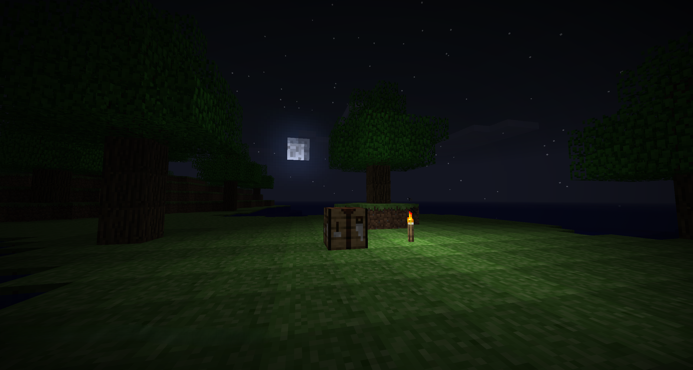

# Nostalgia

Travel between Minecraft eras from the modern game. Each era is its own dimension with its own mechanics, terrain, and atmosphere.



## Eras

- Pre-Classic (RD-132211) - flat 256x256 world, very early Minecraft
- Alpha 1.1.2_01 - trees, biomes, old physics, old lighting
- More eras coming

## How it works

Place a beacon on a charged respawn anchor. The structure starts the Time Machine ritual that teleports you into the chosen era. SHA holograms make the transition smooth, no black screens or lag spikes.

Each era is a real custom dimension with its own world generator, blocks, items, lighting, sounds, and combat rules. Stuff like old water floating, old combat timing, no sprint, suffocation quirks, all faithful to the original.

## Build

```
git clone https://github.com/GUN2RAS/Nostalgia.git
cd Nostalgia
./gradlew build
```

Output jar lands in `build/libs/`.

## Requires

- Minecraft 26.1.2
- Fabric Loader 0.18.6
- Sodium 0.8.9+mc26.1.1
- SHA (Sodium Hologram API) 1.0.6
